# cycleGAN_with_segmentation

cycleGAN model trained together with semantic segmentation network that helps preserve latent embeddings in images from each domain.  
Images from CITYSCAPES and GTA5 dataset look very different- most GTA images have a wide range of sky yet most scenes in CITYSCAPES are collected in urban areas with trees and buildings blocking the sky.  
After doing domain transfer, upper parts of buildings in CITYSCAPES images are erased and replaced with sky, which is not I want.  
Forcing the generator network to preserve the structure of objects in scenes by explicitly training segmentation network on paired data might help prevent such cases...  
updated NOV 03: I noticed that transferring from cityscapes to gta during test phase leads to information loss(cars being erased) from the original domain.

### Train the cycleGAN model
First, under the root directory, run `pip install -r requirements.txt` in command line.

Under $DATAROOT, create 4 folders named trainA, trainB, trainA_labels, trainB_labels. Put the images(in jpg) from synthetic domain in trainB, real world in trainA, and the corresponding semantic segmentation masks(in 8 bit, png, with pixel value==class id) in the label folders. 

Then, run
`python train.py --dataset_path=$DATAROOT --save_per_epochs=1`

By default only labels in domain B are used, function of training with labels from domain A to be added.

The output images and losses are stored under `./logs/`, and the models are stored under `./models`. Specify `--out_dir` in the argument to change the directory.

To continue training, specify `--model_path=$MODEL_PATH`

### Test the cycleGAN model
run `test.py --image_path=$PATH_TO_THE_IMAGES --model_path=$PATH_TO_MODELS --out_dir=$OUT_DIR --direction=$direction`, notice that the test images should be pngs with the same dimension the model is trained on, and direction should be AB or BA(AB for cityscapes to GTA, and BA the opposite). The images transferred to the target domain is stored under $OUT_DIR.

### Train Unet
TODO

### Evaluate performance
Under $DATAROOT, create 2 folders named x and gt, put test images(png) and their masks(png, format the same as cycleGAN masks) in x and gt. 
Then run
`test_semseg.py --image_path=$DATAROOT --model_path=$PATH_TO_SEMSEG_MODEL --out_dir=$OUT_DIR`

### TODO list
- [ ] Add VGG
- [ ] Add validation
- [ ] combine training of unet & normal
- [ ] plot the performance wrt amount of synthetic data used to train the network vs some synthetic + real to synthetic
- [ ] plot the performance ratio real/syn (starting with 100% syn)
- [ ] clean up code & update usage
- [x] Add save/load model
- [x] Add segmentation network
- [ ] multithread processing
- [x] add loss plot with tensorboardX
- [ ] train in higher resolution
- [ ] hyperparameter tuning
- [ ] clean up dataset
- [ ] collect and train with coarse-labelled images

## Results up to date
GTA5 images            |   After domain transfer
:-------------------------:|:-------------------------:
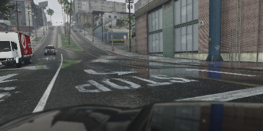  |   
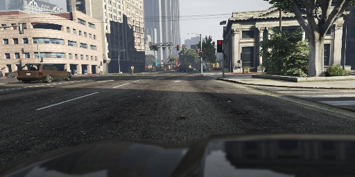  |  
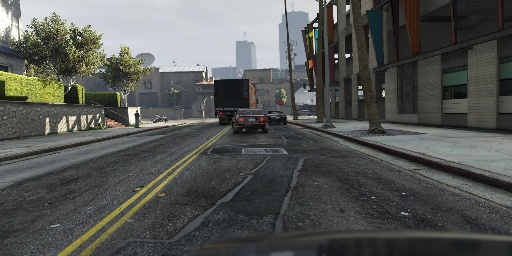  |  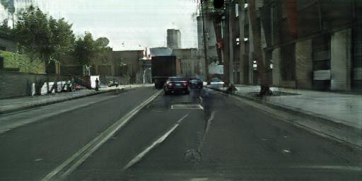
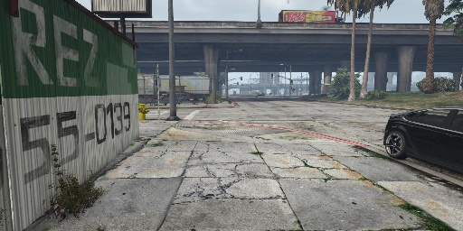  |  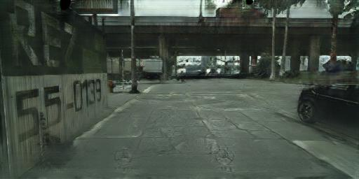

CITYSCAPES images      |   After domain transfer
:-------------------------:|:-------------------------:
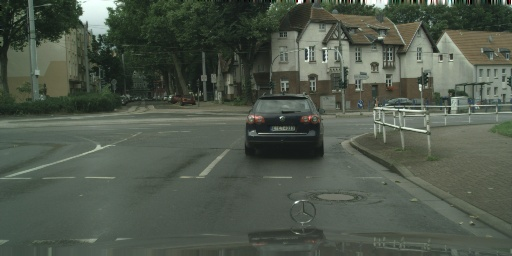 | 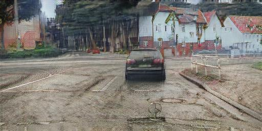 
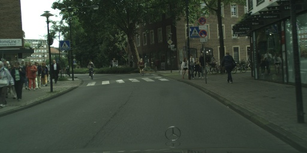 | 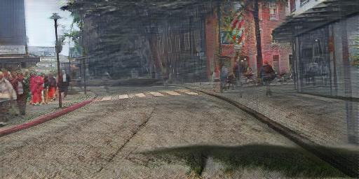 
 | 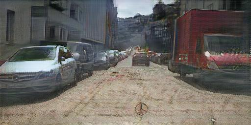 
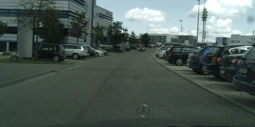 | 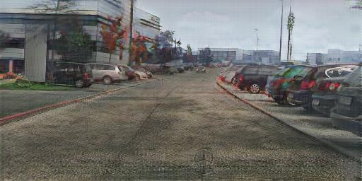 

