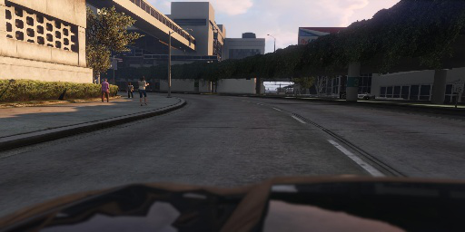
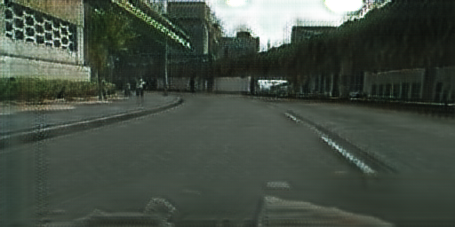
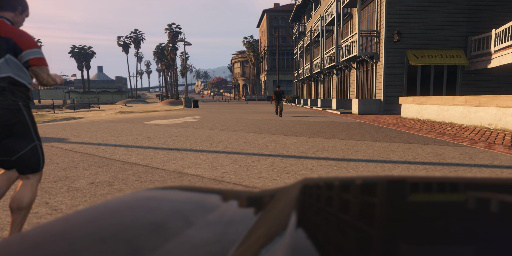
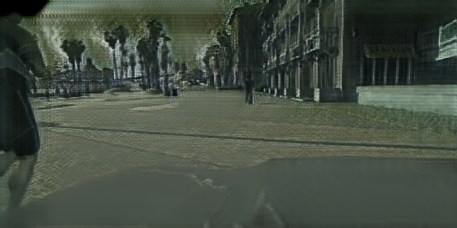
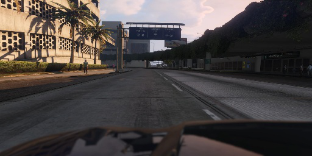
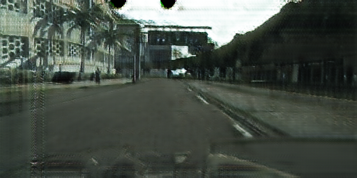
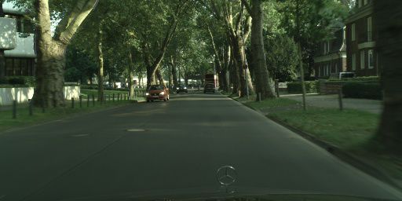
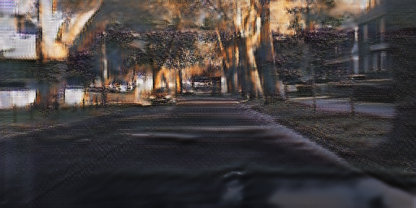
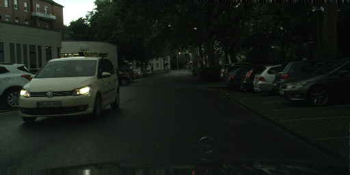
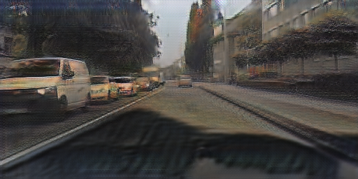

# cycleGAN_with_segmentation

cycleGAN model trained together with semantic segmentation network that helps preserve latent embeddings in images from each domain.  
Images from CITYSCAPES and GTA5 dataset look very different- most GTA images have a wide range of sky yet most scenes in CITYSCAPES are collected in urban areas with trees and buildings blocking the sky.  
After doing domain transfer, upper parts of buildings in CITYSCAPES images are erased and replaced with sky, which is not I want.  
Forcing the generator network to preserve the structure of objects in scenes by explicitly training segmentation network on paired data might help prevent such cases...  

### TODO list
- [x] Add save/load model
- [x] Add segmentation network
- [ ] multithread processing
- [x] add loss plot with tensorboardX
- [ ] train in higher resolution
- [ ] hyperparameter tuning
- [ ] clean up dataset
- [ ] collect and train with coarse-labelled images

## Results up to date
GTA5 images            |   After domain transfer
:-------------------------:|:-------------------------:
  |  
  |  
  |  

CITYSCAPES images      |   After domain transfer
:-------------------------:|:-------------------------:
  |  
  |  
  |  

